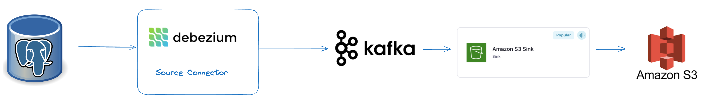

# Data Pipeline Setup: PostgreSQL to Kafka to S3
Source SQL data from PostgreSQL to Kafka using JDBC source connector and sink the data to S3 bucket using S3 Sink Connector

# Architecture

# Overview
This document provides detailed steps for sourcing data from a PostgreSQL database to Apache Kafka in Confluent Cloud using the Confluent JDBC Source Connector and then sinking the data to an Amazon S3 bucket using the Confluent S3 Sink Connector.

# Prerequisites

- Confluent Cloud Account: Access to a Confluent Cloud account.
- Kafka Cluster: A running Kafka cluster in Confluent Cloud.
- Confluent Cloud Connectors: Access to the Confluent Cloud Connectors.
- PostgreSQL Database: Access to a PostgreSQL database.
- Amazon S3: Access to an S3 bucket for data storage.

# Step-by-Step Instructions

1. Set Up PostgreSQL JDBC Driver
Confluent Cloud manages the JDBC driver internally, so you don't need to manually upload the driver. Ensure that your PostgreSQL instance is accessible from Confluent Cloud.

2. Configure the JDBC Source Connector

    1. Create a New Connector:

        - Log in to the Confluent Cloud Console.

        - Navigate to the Connectors section under your Kafka cluster.

    2. Add a New JDBC Source Connector:

        - Click on Create Connector.

        - Select JDBC Source Connector from the available connectors.

    3. Configure the JDBC Source Connector:

        - Fill in the required configuration details:

            - Connector Name: e.g., jdbc-source-postgres

            - Connection URL: jdbc:postgresql://<POSTGRES_HOST>:<POSTGRES_PORT>/<DATABASE>

            - Connection User: <USER>

            - Connection Password: <PASSWORD>

            - Mode: Select Incrementing or Timestamp depending on your use case.

            - Incrementing Column Name: Specify the column to use for incrementing mode.

            - Table Whitelist: Specify the tables to include (e.g., schema.table1,schema.table2).

            - Topic Prefix: e.g., postgres- to set the prefix for Kafka topics.

            - Save the configuration.

3.  Configure the S3 Sink Connector

    1. Create a New Connector:

        - In the Confluent Cloud Console, navigate to the Connectors section.

        - Click on Create Connector.

        - Select S3 Sink Connector from the available connectors.

    2. Configure the S3 Sink Connector:

        - Connector Name: e.g., s3-sink

        - Topics: Enter the Kafka topics to sink data from (e.g., postgres-table1).

        - S3 Bucket Name: Specify your S3 bucket name.

        - S3 Region: Specify the AWS region of your S3 bucket.

        - Format: Choose the format (e.g., JSON or Avro).

        - Flush Size: Number of records before writing to S3 (e.g., 10000).

        - Partitioner Class: Set up as needed (e.g., TimeBasedPartitioner).

## Result

